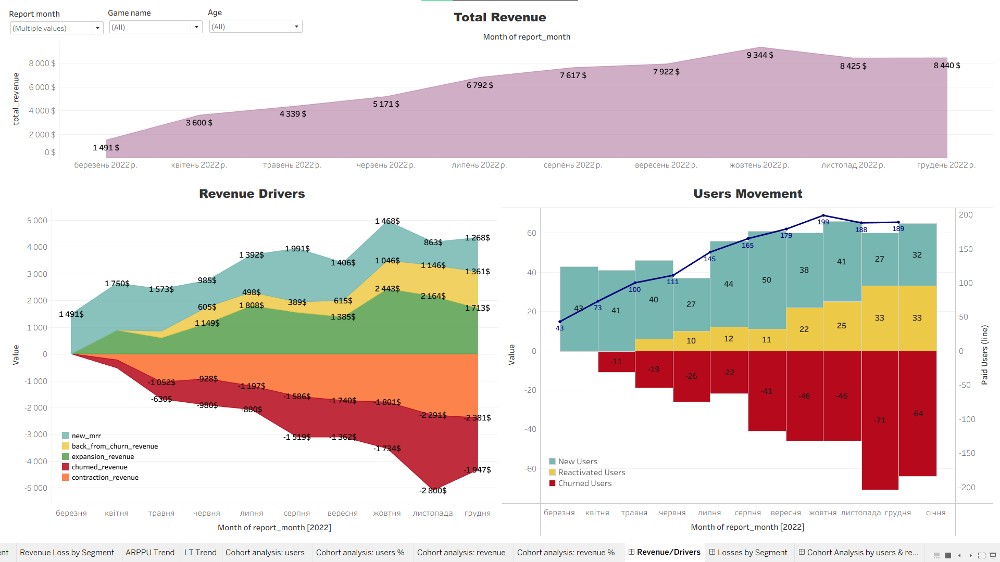
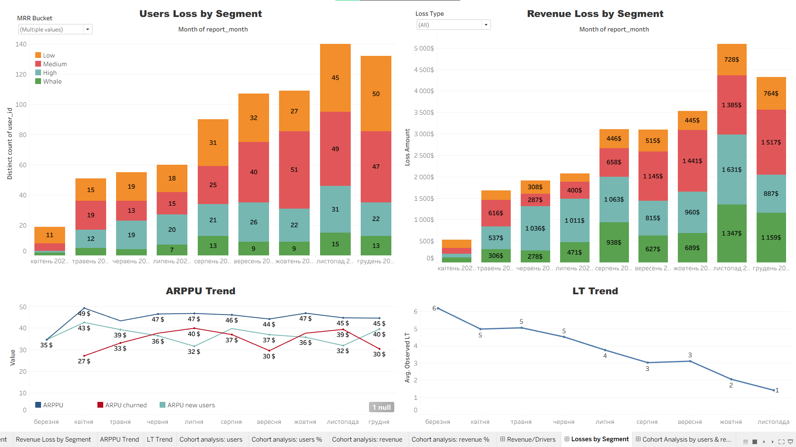
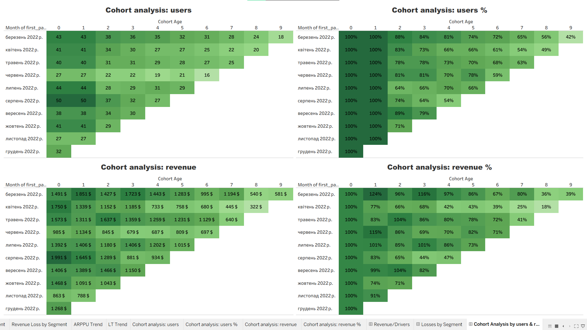

# Gaming Product Metrics Analysis

SQL and Tableau product analytics project focused on gaming revenue dynamics, churn, contraction, cohort retention, and revenue drivers behind the November 2022 revenue drop.

## Project Overview

This project analyzes monthly revenue dynamics for a gaming product using SQL and Tableau.

The main goal was to investigate the revenue drop in November 2022 and understand whether it was caused by a specific user segment, churn, revenue contraction, or changes in cohort behavior.

## Tools Used

* **PostgreSQL / DBeaver** — data preparation and metrics calculation
* **SQL** — cohort analysis, revenue decomposition, churn and contraction logic
* **Tableau Public** — dashboard creation and data visualization

---

  
<b>Dataset</b>

The analysis is based on payment transactions and paid user attributes.

Main tables:

* `games_payments` — payment date, user ID, and revenue amount
* `games_paid_users` — user characteristics such as language, age, and device type

Transactional data was aggregated to the user-month level to analyze monthly revenue behavior.

  
<b>Business Questions</b>

The analysis focused on the following questions:

* What caused the revenue drop in November?
* Was the decline mainly driven by whale users?
* How much revenue was lost due to churn and contraction?
* Do user retention and revenue retention move in sync?
* Which user segments contribute the most to revenue losses?
* Can payment contraction be used as an early warning signal before churn?

  
<b>Analysis Approach</b>

The project includes:

* Monthly revenue trend analysis
* Revenue decomposition into:

  * new revenue
  * reactivation revenue
  * expansion revenue
  * contraction revenue
  * churned revenue
* User and revenue loss analysis by previous MRR segment
* Cohort analysis by users and revenue
* ARPPU and observed lifetime trend analysis

---

## Dashboard Preview

### Revenue and Drivers

### Losses by Segment

### Cohort Analysis

---

  
<b>Key Findings</b>

1. **The November revenue drop was not explained by a mass exodus of whale users only.**
   Losses were distributed across several user segments, not only the Whale segment.

2. **November had the highest combined revenue losses in the analyzed period.**
   Total revenue losses from churn and contraction reached their highest level, with the largest contribution coming from Whale, High, and Medium users.

3. **Churn and contraction showed different segment patterns.**
   Churn was more visible by user count among Low and Medium users, while contraction losses were more financially significant among High and Whale users.

4. **Contraction should be monitored separately from churn.**
   high-value users did not always leave immediately, but their payments decreased. This means that revenue risk can appear before full churn.

5. **User retention and revenue retention were not synchronized.**
   Some cohorts retained a relatively good share of users but generated much less revenue over time. For example, the April cohort still retained users, but its revenue retention dropped sharply after the first months.

6. **Acquisition volume alone does not explain revenue quality.**
   August had the largest starting cohort, but its revenue retention decreased quickly in the following months. This suggests that user quality and monetization behavior matter more than just the number of new users.

7. **The revenue decline appears to be a complex issue, not a single-factor problem.**
   It is likely connected not only to churn, but also to incoming traffic quality, monetization quality of existing users, customer base retention, and payment contraction as a possible early warning signal before churn.

  
<b>Recommendations</b>

### Additional Data to Collect

1. **Acquisition channels and campaign data**
   To analyze how traffic quality affects monetization and revenue decline.

2. **Marketing spend by campaign**
   To compare revenue quality with acquisition cost and evaluate the profitability of paid users.

3. **In-game events, promotions, and offer calendar**
   To check whether revenue drops were connected to changes in offers, discounts, pricing, or game events.

4. **Purchase-level details**
   Product or package type, price, discount, currency, and payment method would help explain why users started paying less.

5. **User activity data**
   Sessions, active days, level, progress, and event participation would help distinguish between product engagement issues and payment behavior issues.

### Further Analysis

1. **MRR bucket transition analysis**
   Track how users move between Low, Medium, High, Whale, and Churned statuses to test whether payment contraction is an early warning signal before churn, especially in High and Whale segments.

2. **Cohort analysis by user segment**
   Compare user retention and revenue retention separately for Low, Medium, High, and Whale users.

3. **Detailed analysis of November and December loss drivers**
   Check what changed in campaigns, offers, pricing, events, or payment behavior during the months with the highest losses.

4. **Payment frequency vs. payment amount decomposition**
   Identify whether revenue declined because users paid less often or because their average payment amount decreased.

5. **New user quality analysis**
   Compare acquisition cohorts by ARPPU, revenue retention, and later churn to understand whether some cohorts brought lower-value users.

### Immediate Business Actions

1. **Monitor payment contraction among high-value users**
   Flag users whose monthly payments decrease by more than a defined threshold before they fully churn.

2. **Separate retention strategies by segment**
   Low and Medium users should be targeted with churn prevention and reactivation campaigns. High and Whale users should be targeted with personalized monetization recovery before churn.

3. **Create targeted campaigns for active users who started paying less**
   These users are not lost yet, but they already show revenue risk. Personalized offers or reactivation incentives may help recover part of the lost revenue.

4. **Track revenue retention by cohort on a regular basis**
   Total revenue alone can hide the problem. Cohort revenue retention helps detect whether new users continue generating value after acquisition.

5. **Do not focus only on Whale users**
   Medium and High users also contributed significantly to revenue losses, so retention and monetization actions should cover several valuable segments.

  
<b>Limitations</b>

* The dataset does not include acquisition channels, marketing campaign data, in-game events, or pricing changes.
* December churn should be interpreted carefully because it is the last available month in the dataset.
* Later cohorts have shorter observation windows, so cohort comparisons should be made at the same cohort age.

---

## Project Files

* [SQL query](sql/gaming_product_metrics.sql)
* [Tableau Public Dashboard](https://public.tableau.com/app/profile/.88467722/viz/productanalysis_17814726284760/LossesbySegment)

